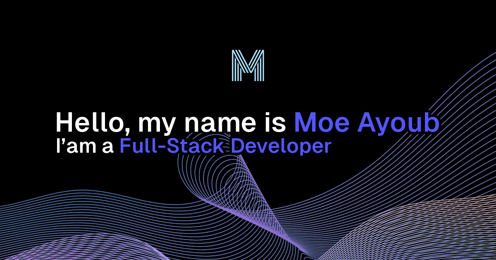

# portfolio

## Description

This is my personal portfolio. Built with Next.js, React.js, TypeScript & Tailwind.

I chose to switch to Next.js from Nuxt.js due to Next's supieror server components.

The most challenging part for me was to familiarize myself with how Next.js operates and it is (for the most part) extremely similar to Nuxt.

## Backend

    
    

## Frontend

    
    
    
    

## License

[End-User License Agreement (EULA) of portfolio](https://www.eulatemplate.com/live.php?token=7DlkmycJf9FkjqotsXL4gYNIhu9iw5e7)
